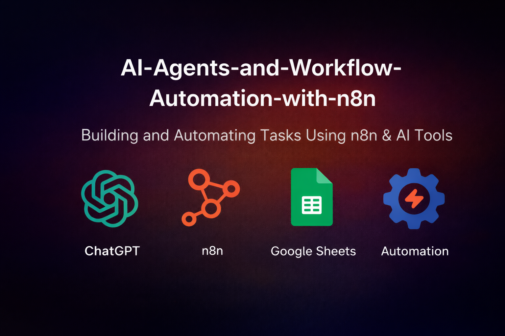

# AI agents & Workflow Automation Projects with n8n

## Repository Description 

n8n (pronounced “n-eight-n”) is a powerful tool that allows you to connect any app with an API to another app and manipulate its data with minimal or no code.

## Key Features:

**Customizable**: Highly flexible workflows with the ability to build custom nodes.

**Convenient**: Run locally via npm or Docker, or use the Cloud option to have the infrastructure managed for you.

**Automation-Ready**: Perfect for automating repetitive tasks across multiple apps.

This repository contains automation projects from begineer to advanced, workflow templates, and AI integrations using n8n to help you get started quickly.
