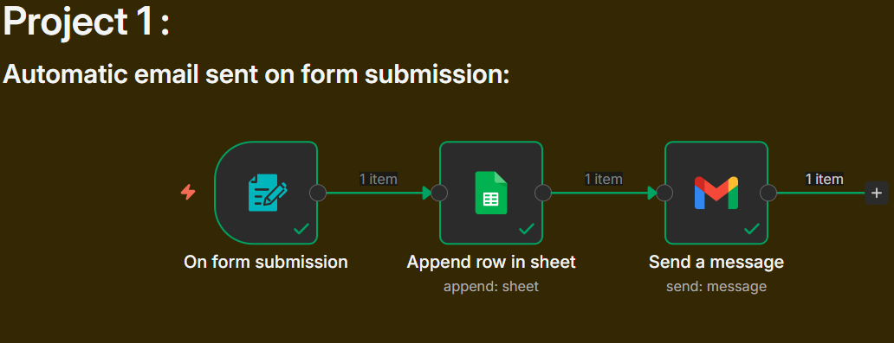

# Automated Email Notification on Form Submission Using n8n
## Project Overview
This project demonstrates how to automate sent email notifications using n8n form trigger whenever a user submits a form. The automation captures form data, processes it, and sends a confirmation or notification email automatically without manual intervention. This workflow helps reduce manual work, improves response time, and ensures consistent communication with users or internal teams.

## Workflow
Form Submission → Google Sheets → Email Notification
## Tools Used
-	n8n – Workflow automation tool
-	n8n Form Trigger Node– To receive form submission data
-	Google sheet Node – Append Row
-	Gmail Node () – To send automated emails (Send Message)

## Conclusion
This project implements an end-to-end automated email notification system using n8n. It captures form submissions, stores data in Google Sheets, and sends real-time email notifications, reducing manual effort and improving response efficiency.

